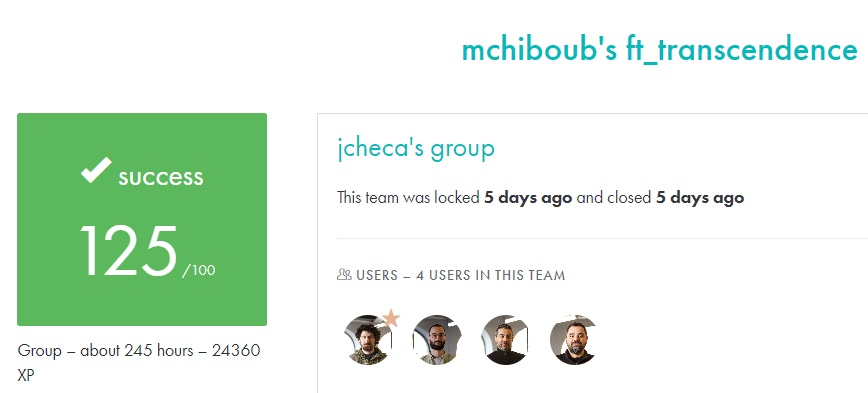

# FT_TRANSCENDENCE #

## What the project does: ##
The ft_transcendence project involves creating a multiplayer web application centered around a Pong game. The application must support real-time gameplay, user registration, matchmaking, and tournament systems. It also requires implementing various modules for user management, security, AI opponents, and more, with a focus on customization and extensibility.

## Why the project is useful: ##
This project is useful because it combines multiple domains of web development, including front-end, back-end, real-time multiplayer interaction, and cybersecurity. It provides practical experience with modern web technologies, containers (Docker), and secure application development, making it a valuable learning experience for full-stack development.

[Subject of this project](en.subject.pdf)